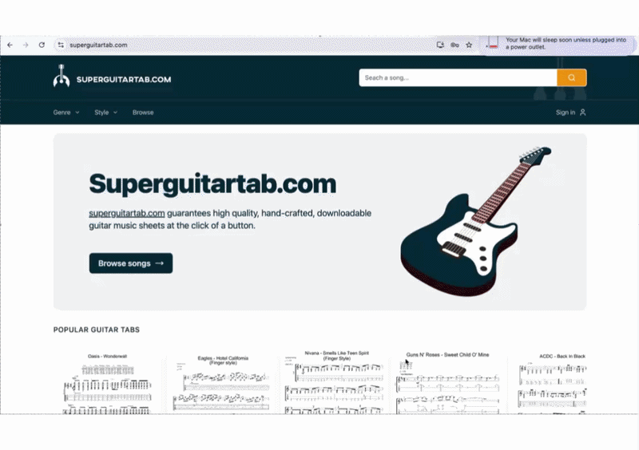

# Superguitartab.com

## Summary
This is the code for Superguitartab.com. We are a web application that allows users to browse, preview, and download high-quality guitar tablature sheets. The platform focuses on delivering a clean, fast, and intuitive experience for guitar players who want quick access to accurate tabs without friction or clutter.

---

## I want to download music sheets
Please visit out website [superguitartab.com](https://www.superguitartab.com).

---

## Preview

## Tech Stack

### Frontend
- **React**
- **Tailwind CSS** 

### Backend
- **FastAPI** 
- **SQLAlchemy** 
- **Pydantic**
- **Celery**

### Database
- **PostgreSQL**

### Infrastructure
- **Azure** 
- **Docker**
- **Terraform**
- **Ansible**
- **CI/CD (Github Actions)**

### Testing
- **Pytest**
- **Playwright**

---

## Current Architecture Diagram and scaling

This is the current architecture of the application. 

Running on Azure, there is a single virtual machine hosting a container for an NGINX reverse proxy, the React frontend, and the Python FastAPI server.

This virtual machine is connected to an Azure Database for PostgreSQL.

The reason for the single virtual machine is an engineering decision due to cost. The application is currently providing a free service, so the cost of the application needs to be as low as possible.

When the application becomes paid, we will horizontally scale the software to:

- The React build being served on the object storage and via a cdn.
- A load balancer in front of three virtual machines, each hosting its own api server. This is to prevent DDOS and to handle more traffic.
- Keep architecture stateless by making Redis, for sessions, centralised and outside the servers.

---

## Software Developer Documentation
Please see the [developer documentation](./docs/README.md) for a description of how to run, test, deploy and backup the service.

---