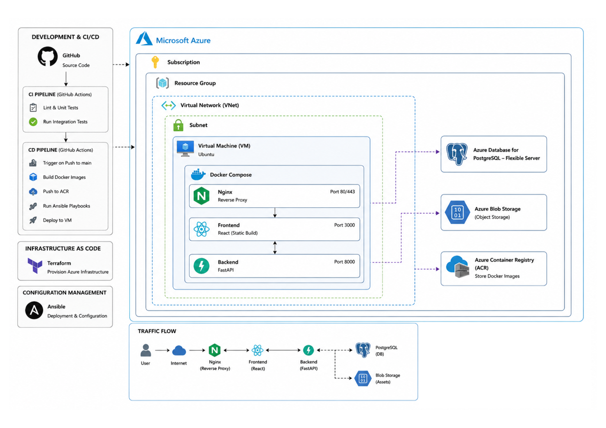

[Superguitartab.com](../../README.md) >
[Developer documentation](../README.md) >
System overview

# System overview

This document provides a high-level overview of how the SuperGuitarTab system operates, including the core technologies used, the role of each component, and how they interact to deliver the application.  
This serves as a reference for developers, maintainers, and contributors who need to understand the structure and operation of the system.

---

# Technologies Used

Superguitartab is built using a modern, containerized full-stack architecture.  
Below is an overview of the primary technologies and why they are used:

| Layer                              | Technology               | Purpose                                                                                                                    |
|------------------------------------|--------------------------|----------------------------------------------------------------------------------------------------------------------------|
| **Frontend**                       | React                    | UI rendering, user interaction                                                                                             |
| **Static Hosting / Reverse Proxy** | Nginx                    | Terminates SSL, Serves React build, reverse-proxies API requests, caches static assets and performs gzip file compression. |
| **Backend API**                    | FastAPI                  | Core API, business logic, file access                                                                                      |
| **ORM / Database Layer**           | SQLAlchemy               | Defines models and handles DB interactions                                                                                 |
| **Relational Database**            | PostgreSQL               | Persistent structured data storage                                                                                         |
| **Storage**                        | Azure Blob Storage       | PDF/tab file storage                                                                                                       |
| **Containerization**               | Docker & Docker Compose  | Packaging and running all services                                                                                         |
| **Cloud Platform**                 | Azure                    | Hosting, networking, storage, registry                                                                                     |
| **CI/CD**                          | GitHub Actions           | Automated builds, testing, deployments                                                                                     |
| **Container Registry**             | Azure Container Registry | Stores Docker images for deployment                                                                                        |

---

# Technology Breakdown

## Nginx (Reverse Proxy)
Nginx sits at the entry point of the Droplet and handles all incoming traffic.

### Responsibilities
- Routes `/api/*` paths to the FastAPI container  
- Routes `/*` paths to React container
- Handles gzipping, caching headers, and performance tuning  
- Integrates with SSL

Nginx ensures clean separation between frontend and backend layers.

We have three different Nginx configuration:
- Development
- Production
- Maintenance

Development handles only port 80

Production handles SSL termination and is open on port 443 and 80. Port 80 redirects to port 443.

Maintenance serves a static web page for when the site needs down time

---

## React (Frontend)
React is used to build the browser-based user interface for superguitartab.com.

The React app is compiled into static files (`/build`) and served directly through Nginx.

---

## Nginx (Frontend web server)

### Responsibilities
- Serves the **React static build**

---

## FastAPI (Backend)
FastAPI is the core application server responsible for:

- Exposing REST API endpoints  
- Managing tabs metadata
- Communicating with PostgreSQL through SQLAlchemy  
- Generating or retrieving download URLs for Spaces-stored files  

It runs inside a Docker container using **Uvicorn** for async performance.

---

## PostgreSQL (Relational Database)
PostgreSQL stores the application's relational data, including:

- Guitar tab metadata  
- Song details  
- File keys and references  
- Download counts  
- Future users/auth tables  

The database is hosted as Azure's service Azure Database For Postgres 

---

## Azure Blob Storage (Object Storage)
Spaces is used for file storage:
- Guitar tab PDFs

---

## Docker & Docker Compose (Containerization)
All services: frontend, backend, reverse-proxy —run inside Docker containers.

---

## CI/CD (Github Actions)
GitHub Actions automates:

- Running tests  
- Building Docker images  
- Pushing images to Registry  
- Deploying to the Azure virtual machine (e.g., via SSH + Docker Compose pulls)

---

## Architecture Diagram

